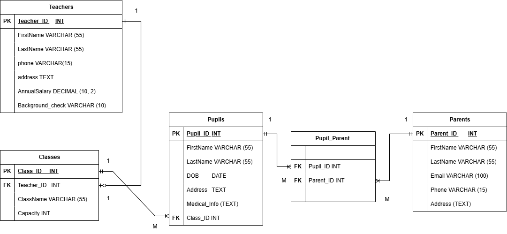

# St_Alphonsus_School Management System Website

## Overview
The **School Management System** is a web application developed using **PHP** and **MySQL** to efficiently manage school records, including students, teachers, classes, and parents. The system ensures smooth data handling through structured database relationships and user-friendly interfaces.

## Features
### Database & Table Creation
- **Database:** `st_alphonsus_school`
- **Tables:**
  - `classes`: Stores class details (`Class_ID` as PK, `Teacher_ID` as FK).
  - `pupils`: Stores pupil details (`Pupil_ID` as PK, `Class_ID` as FK).
  - `parents`: Stores parent/guardian details (`Parent_ID` as PK).
  - `pupil_parent`: Junction table for the many-to-many relationship between pupils and parents.
  - `teachers`: Stores teacher details (`Teacher_ID` as PK).

### Relationships & Constraints
- **One-to-Many**: `classes` → `pupils`
- **One-to-One**: `classes` → `teachers`
- **Many-to-Many**: `pupils` ↔ `parents` (via `pupil_parent`)
- **Referential Integrity**: Enforced using foreign key constraints with `ON DELETE SET NULL` or `ON DELETE CASCADE`.

### ER Diagram
- Designed using **Draw.io** with **Crow’s Foot Notation** to indicate cardinality.
- Includes **entities, attributes, primary keys (PK), and foreign keys (FK)**.
- 

## System Functionality
### Dashboard (`index.php`)
- Establishes a **database connection** via `connection.php`.
- Displays key statistics (total classes, teachers, pupils, parents) using `COUNT(*)` SQL queries.
- Features a **navigation menu** for easy access to different management pages.
- Uses `style1.css` for UI styling.

### Class Management
- **Manage Classes (`class.php`)**:
  - Displays all class records.
  - Allows adding new classes (Class Name, Teacher ID, Capacity).
  - Supports **Edit/Delete** actions.
- **Update Class (`update_class.php`)**:
  - Fetches and modifies class details.
- **Delete Class (`delete_class.php`)**:
  - Removes class records from the database.

### Pupil Management
- **Manage Pupils (`pupil.php`)**:
  - Displays pupil records.
  - Supports adding new pupils (Name, Class ID, Age, etc.).
  - Provides **Edit/Delete** options.
- **Supporting Files:**
  - `update_pupil.php`: Updates pupil details.
  - `delete_pupil.php`: Deletes pupil records.

### Teacher Management
- **Manage Teachers (`teacher.php`)**:
  - Displays all teachers.
  - Allows adding new teachers (Name, Subject, Experience).
  - Includes **Edit/Delete** options.
- **Supporting Files:**
  - `update_teacher.php`: Updates teacher details.
  - `delete_teacher.php`: Deletes teacher records.

### Parent Management
- **Manage Parents (`parent.php`)**:
  - Displays parent records.
  - Supports adding new parents (Name, Pupil ID, Contact Information).
  - Provides **Edit/Delete** options.
- **Supporting Files:**
  - `update_parent.php`: Updates parent details.
  - `delete_parent.php`: Removes parent records.

## Technologies Used
- **Backend:** PHP
- **Database:** MySQL
- **Frontend:** HTML, CSS
- **Diagram Design:** Draw.io

